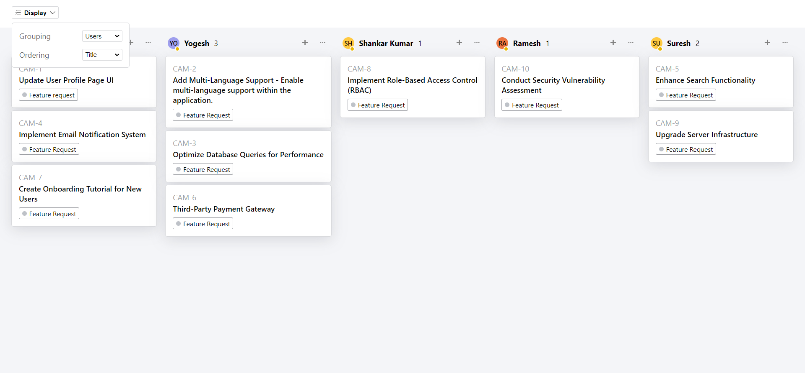

# Quicksell Assignment
### *Live Demo Link [link](https://quicksell-assignment-001.netlify.app/)*

## About Me
Hello, I'm Kritik Verma, final year undergrad at IIT Ropar and a software Developer with a strong track record of successful internships and a passion for innovative web solutions. I bring a wealth of experience in frontend development. From crafting robust React.js frontends and lambda api's at 'I’mbesideyou'(summer internship) to optimizing features and creating interactive dashboards at 'Mobishaala' (winter internship). 

### My GitHub Profile [link](https://github.com/vermakritik222)
### My Resume [link](https://drive.google.com/drive/u/2/folders/1WpYToOE4sJ94SIl1W9tw-so5TATxtZRR)

## Screenshots of UI

### Group By Users

### Group By Priority

### Group By Status

## Key Features of UI
1. There is an availability status displayed on avatar
2. UI Buttons has ripple animations 
3.  State of grouping and ordering is stored as per instructions
4.   UI is build by using flex box which makes it more smooth and dynamic

---